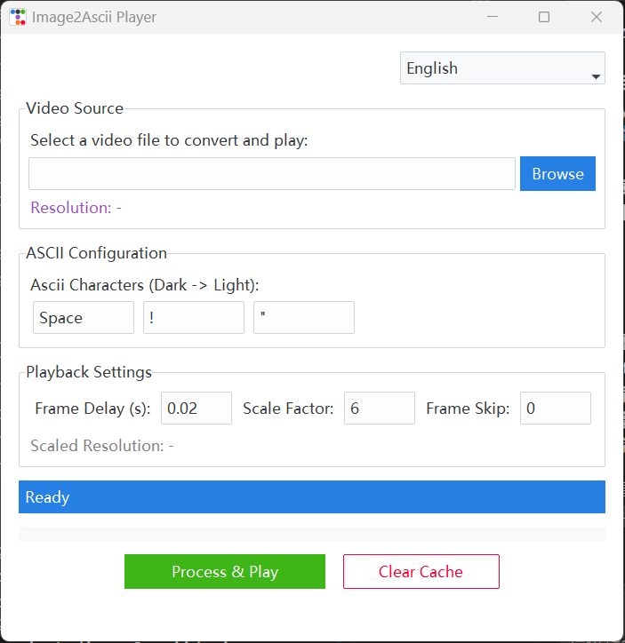

# Image2Ascii Player 🎥 -> 🔢

[English](#english) | [中文](#chinese)

<a name="english"></a>


There are many tools to convert video to ASCII code. This program mainly designs a convenient graphical interface so that ordinary people can operate it directly.




## ✨ Features

* **Graphical Interface**: Modern GUI based on `ttkbootstrap`, simple operation, and good looking.
* **Multi-language Support**: Built-in support for English, Simplified Chinese, and Traditional Chinese.
* **Highly Customizable**:
  * Custom ASCII character set (from dark to bright).
  * Adjust Scale Factor to fit different terminal window sizes.
  * Control playback speed (frame delay) and frame skipping.
* **Automatic Processing**: Automatically decomposes video into frames and converts them to ASCII text.
* **Cross-platform**: Supports Windows, Linux, and macOS (requires terminal support).

## 🛠️ Installation

Before using this tool, please ensure that Python 3.x is installed on your system.

1. **Clone or download this project** to your local machine.

2. **Install dependencies**:
   Open a terminal or command prompt and run the following command to install the required Python libraries:

   ```bash
   pip install numpy pillow ttkbootstrap opencv-python
   ```

   Or directly use the exported binary file (only x64 Windows executable is provided).

## 🚀 Usage

### Method 1: Graphical Interface (Recommended)

This is the easiest way to use it.

1. Run `gui.py`:

   ```bash
   python gui.py
   ```

2. In the opened window:
   * Click **Browse** to select a video file (e.g., `.mp4`, `.avi`, etc.).
   * Adjust **Scale Factor** as needed. The larger the value, the smaller the generated ASCII art (lower resolution). If the terminal window is small, it is recommended to increase this value.
   * Click **Process & Play**.

3. The program will automatically extract video frames, generate ASCII characters, and start playing in the terminal!

### Method 2: Command Line Playback (Play Cache Only)

If you have already generated ASCII text cache via GUI (in the `textout/` directory), you can directly use `img2ascii.py` for playback:

```bash
# Format: python img2ascii.py [delay] [skip]
# delay: Delay time per frame (seconds), default 0.02
# skip: Number of frames to skip, default 0

python img2ascii.py 0.03 1
```

## ⚙️ Configuration

* **Scale Factor**: Determines the size of the output ASCII art.
  * `Scale = 1`: Original resolution (usually too large for the terminal to display).
  * `Scale = 10`: Width/Height reduced to 1/10 of the original.
  * *Tip*: If the image wraps or is messy during playback, please increase this value or maximize the terminal window.
* **Frame Delay**: Controls playback speed. The smaller the value, the faster the speed.

## 📂 Directory Structure

* `gui.py`: Main program entry, graphical interface.
* `img2ascii.py`: Core conversion logic and command line player.
* `config.json`: Saves user language and window position configuration.
* `imgout/`: (Auto-generated) Stores temporary image frames extracted from video.
* `textout/`: (Auto-generated) Stores converted ASCII text files.

## ⚠️ Notes

* **Processing Speed**: The core of this program takes the green part of a frame as input in the form of a 2D array, divides the color value of each position by 100 through a for loop, and maps it to the character table (the author is too lazy to batch process). The processing efficiency is extremely low, specifically designed to improve everyone's patience.

* **Terminal Performance**: Playing character animation requires the terminal to have a fast refresh rate. It is recommended to use **Windows Terminal** or **iTerm2**. Traditional cmd.exe may flicker. (In fact, Windows Terminal also showed flickering linearity during testing).
* **Font**: It is recommended to use monospaced fonts (such as Consolas, Fira Code) in the terminal for the best viewing effect.

## 🤝 Contribution

*Thanks to Bilibili uploader ELe Laboratory for the tutorial [Original Video Address](https://www.bilibili.com/video/BV11E411w7ec/?spm_id_from=333.1387.upload.video_card.click)
[Uploader Homepage](https://space.bilibili.com/481434238)

*Welcome to submit Issues or Pull Requests to improve this project!

---
*Enjoy your ASCII movies!* 🎞️

<br>

---

<a name="chinese"></a>

# Image2Ascii Player 🎥 -> 🔢


视频变成ASCII码的工具还是很多的，本程序主要是设计了一个方便操作的图形化界面，普通人可以直接操作。


我是真爱粉（确信）

## ✨ 功能特性

* **图形化界面**: 基于 `ttkbootstrap` 的现代化 GUI，操作简单，颜值在线。
* **多语言支持**: 内置英语、简体中文和繁体中文支持。
* **高度可定制**:
  * 自定义 ASCII 字符集（从暗到亮）。
  * 调整缩放比例（Scale Factor）以适应不同大小的终端窗口。
  * 控制播放速度（帧延迟）和跳帧数。
* **自动处理**: 自动将视频分解为帧，并转换为 ASCII 文本。
* **跨平台**: 支持 Windows, Linux 和 macOS (需终端支持)。

## 🛠️ 安装指南

在使用本工具之前，请确保你的系统中已安装 Python 3.x。

1. **克隆或下载本项目** 到本地。

2. **安装依赖库**:
   打开终端或命令提示符，运行以下命令安装所需的 Python 库：

   ```bash
   pip install numpy pillow ttkbootstrap opencv-python
   ```

   或者直接只用导出的二进制文件（仅提供x64Windows的运行文件）

## 🚀 使用方法

### 方式一：图形界面 (推荐)

这是最简单的使用方式。

1. 运行 `gui.py`：

   ```bash
   python gui.py
   ```

2. 在打开的窗口中：
   * 点击 **Browse (浏览)** 选择一个视频文件（如 `.mp4`, `.avi` 等）。
   * 根据需要调整 **Scale Factor (缩放比例)**。数值越大，生成的字符画越小（分辨率越低）。如果终端窗口较小，建议调大该数值。
   * 点击 **Process & Play (处理并播放)**。

3. 程序将自动提取视频帧，生成 ASCII 字符，并在终端中开始播放！

### 方式二：命令行播放 (仅播放缓存)

如果你已经通过 GUI 生成了 ASCII 文本缓存（在 `textout/` 目录下），你可以直接使用 `img2ascii.py` 进行播放：

```bash
# 格式: python img2ascii.py [delay] [skip]
# delay: 每一帧的延迟时间（秒），默认 0.02
# skip: 跳过的帧数，默认 0

python img2ascii.py 0.03 1
```

## ⚙️ 配置说明

* **Scale Factor (缩放比例)**: 决定了输出字符画的大小。
  * `Scale = 1`: 原始分辨率（通常太大，终端无法显示）。
  * `Scale = 10`: 宽/高缩小为原来的 1/10。
  * *提示*: 如果播放时画面折行或错乱，请增大此数值或最大化终端窗口。
* **Frame Delay (帧延迟)**: 控制播放速度。数值越小速度越快。

## 📂 目录结构

* `gui.py`: 主程序入口，图形界面。
* `img2ascii.py`: 核心转换逻辑和命令行播放器。
* `config.json`: 保存用户的语言和窗口位置配置。
* `imgout/`: (自动生成) 存放从视频中提取的临时图片帧。
* `textout/`: (自动生成) 存放转换后的 ASCII 文本文件。

## ⚠️ 注意事项

* **处理速度**: 本程序核心是取一个帧的绿色部分以二维数组的形式输入，通过for循环对每一个位置的颜色数值除100再映射到字符表上（可以批量处理的的作者太懒），处理效率极低，专门用来提升大家的耐心。

* **终端性能**: 播放字符动画需要终端具有较快的刷新速度。推荐使用 **Windows Terminal**或 **iTerm2**。传统的 cmd.exe 可能会出现闪烁。（事实上Windows Terminal在测试时也出现了闪烁的线性）
* **字体**: 建议在终端中使用等宽字体（如 Consolas, Fira Code），以获得最佳观看效果。

## 🤝 贡献

*感谢B站up主ELe实验室的教程[原视频地址](https://www.bilibili.com/video/BV11E411w7ec/?spm_id_from=333.1387.upload.video_card.click)
[up主页](https://space.bilibili.com/481434238)

*欢迎提交 Issue 或 Pull Request 来改进这个项目！

---
*Enjoy your ASCII movies!* 🎞️
